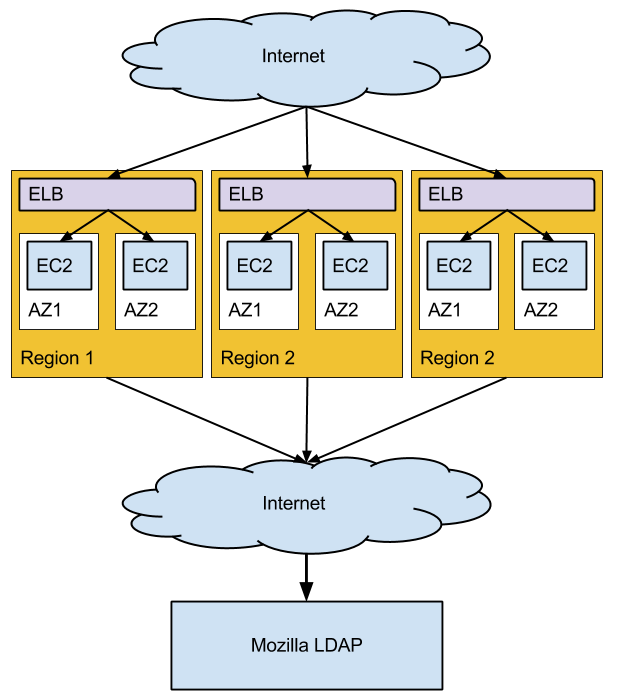

# Mozilla IdP

``mozilla-idp`` is a server that implements support for Persona on the mozilla.com domain.

When deployed, this will allow mozillans with `mozilla.com` or `mozilla.org` email addresses
to authenticate with Persona enabled websites using their Mozilla (LDAP) password.

## Configuration

Note: This section is still in changing. 

### Step N: Creating Public/Private Keypairs

You will need a public and secret key pair to act as a 
[Persona IdP](https://developer.mozilla.org/en-US/docs/Persona/Implementing_a_Persona_IdP). 

    > scripts/gen_keys.js

The `gen_keys.js` command can be run directly. It will write two files into `server/config`, 
`public-key.json` and `secret-key.json`.

Note: this process takes much longer without libgmp installed. Basically javascript vs native
code. Here's how to install the library: 

    Scientific Linux (our production distro)
    ----------------------------------------
    
    TODO

    Ubuntu
    ------

    TODO

### Step N: Creating a Configuration File 

    > cd server/config
    > cp local.json-dist local.json

## Deployment 

* Multi-Region, Multi availability zone deployment
* Use Route53 to DNS load balance across regions and manage region availability
* Use ELB to 
    * terminate SSL 
    * direct traffic to available hosts

